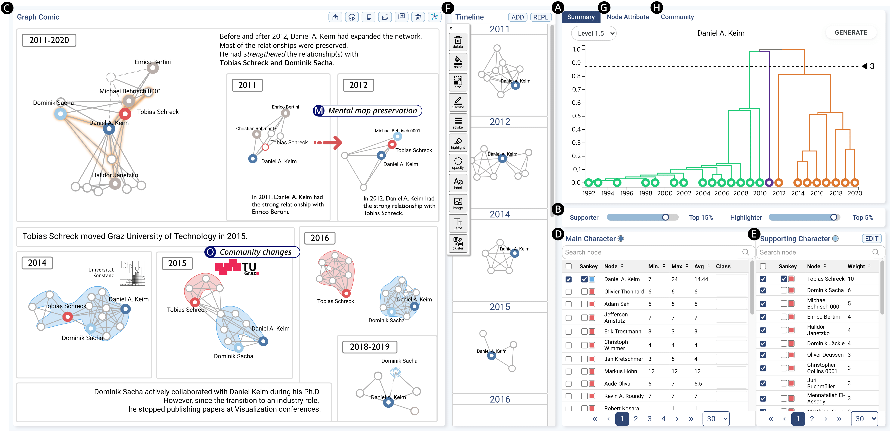

# DGComics: Semi-Automatically Authoring Graph Comics for Dynamic Graphs

DGComics is a novel comic authoring tool for dynamic graphs that allows users to semi-automatically build the comic and annotate it.
The tool uses a hierarchical clustering algorithm that we newly developed for segmenting consecutive snapshots of the dynamic graph while preserving their chronological order.
It also provides rich information on both individuals and communities extracted from dynamic graphs in multiple views, where users can explore dynamic graphs and choose what to tell in comics. 



## How to add your own data to DGComics

- You can add your own processed data to the directory `backend/data/<your data name>`
- Your processed data should contains the following files:

| File                       | Purpose                                                                                                                        |
|----------------------------|--------------------------------------------------------------------------------------------------------------------------------|
| `graph.json`               | Store the actual dynamic graph                                                                                                 |
| `hierarchy_overview.json`  | Store the overall hierarchical clustering dendrogram                                                                            |
| `distance_matrix.json`     | Store the distance matrix between two timestamps                                                                               |
| `comm_lists.json`          | Store the lists of communities over time                                                                                       |
| `partition_lists.json`     | Store the community that a node is a member of in each timestamp                                                               |
| `sankey.json`              | Store the community transition to draw the sankey diagram                                                                      |
| `table.json`               | Store the nodes' features for each timestamp                                                                                   |
| `ego/dissim.json`          | Store the dissimilarity of the ego network of each node between two timestamps, where the main key is the node's label         |
| `ego/year_lists.json`      | Store the dissimilarity of the ego network of each node between two timestamps, where the main key is the years                |
| `neighbor/dissim.json`     | Store the dissimilarity of the neighboring network of each node between two timestamps, where the main key is the node's label |
| `neighbor/year_lists.json` | Store the dissimilarity of the neighboring network of each node between two timestamps, where the main key is the years        |

- The formating details of each file can be found in the following sections

### The Dynamic Graph

- The file `graph.json` contains the information of the dynamic graph: a list of node-link data of the graph at each timestamp. Each element of the list should contain:

| Feature                     | Key   | Value type |
|-----------------------------|-------|------------|
|The timestamp                | time  | int        |
|The nodes of the static graph| nodes | list[Node] |
|The links of the static graph| links | list[Link] |

- The `Node` object should contains

| Feature                     | Key   | Value type |
|-----------------------------|-------|------------|
| The node's ID               | id  | string        |
| The node's label            | label | string |
| The degree of the node | total_num_edges | int |
| The weighted degree of the node | total_weighted_edges | int/float |
| The pagerank value of the node | pagerank | float |
| The eigenvector centrality of the node | eigenvector_centrality | float |
| The closeness centrality of the node | closeness_centrality | float |
| The betweenness centrality of the node | betweenness_centrality | float |
| The categories of the node | category | Object |

For more details on the `category` feature, please check our academic paper and the file [`backend/data/vispub-coauthor/graph.json`](backend/data/vispub-coauthor/graph.json)

- The `Link` object should contains

| Feature                     | Key    | Value type |
|-----------------------------|--------|------------|
| The link's source (node ID) | source | string     |
| The link's target (node ID) | target | string     |
| True if the graph is directed, false otherwise      | is_directed  | bool  |
| The weight of the link      | value  | int/float  |

### The Overall Hierarchical Clustering Dendrogram
The file `backend/data/vispub-coauthor/hierarchy_overview.json` responsible for creating the default dendrogram in the system that computes the hierarchical clustering of the whole graphs. The file consists of the following `HierarchyNode` structure:

| Feature | Key | Value type |
|---------|-----|------------|
| The children of the node | children | list[HierarchyNode] |
| The the string representing all of the timestamp in the node's subtree | name | string |
| If the node is a leaf, it represents a timestamp in the dynamic graph, otherwise, it is the average of the timestamps in its substree | time | float |
| The height of the node | distance | float |

### The Distance Matrix
The file `backend/data/vispub-coauthor/distance_matrix.json` simply contains the distance matrix between all pairs of the graphs. 

### The Community Lists
The file `backend/data/vispub-coauthor/comm_lists.json` contains the lists of communities of each graph. The file should comply the following format
```json
{
    "<timestamp>": {
        "<timestamp>-<communinty id>": [
            "A list of nodes' label"
        ]
    }
}
```

### The Partition Lists
The file `backend/data/vispub-coauthor/partition_lists.json` contains the community that a node is a member of in each graph. The purpose of this file is similar to that of community list. It acts as a reverse mapping of `comm_lists`. The file should comply the following format
```json
{
    "<timestamp>": {
        "Node's label": "Community ID"
    }
}
```

### The Sankey diagram
The file `backend/data/vispub-coauthor/sankey.json` contains the community transition between two consecutive timestamp. The sankey data itself is a graph consisting of two objects: `SankeyNode` and `SankeyLink`. 

- The `SankeyNode` object:

| Feature | Key | Value type |
|---------|-----|------------|
| The ID of the community | id | string |
| The community size | value | int |

- The `SankeyLink` object:

| Feature | Key | Value type |
|---------|-----|------------|
| The previous community ID | source | string |
| The latter community ID | target | string |
| The value of the transition | value | int |

### The nodes' features
The file `backend/data/vispub-coauthor/table.json` contains the nodes' features from each graph. The file should comply the following format

```json
{
    "Node's id": [
        {
            // Nodes' features following the `Node` structure,
            "time": "timestamp"
        }
    ]
}
```

The specification of the `Node` object can be found in the [aforementioned section](#the-dynamic-graph).

### The dissimilarities
In `DGComics`, we support two level of neighboring graph:
- Level 1 (ego network): consists of the main character node and its neighrboring nodes and the connecting links.
- Level 1.5 (neighbor network): same as the previous level but links among the neighboring nodes are added.

At each level we calculated the dissimilarity of each main character's neighboring network, resulting in two files:

- `backend/data/vispub-coauthor/dissim.json`: 
```json
{
    "metadata": [{
        "max": "The maximum dissimilarity (float)",
        "min": "The minimum dissimilarity (float)"
    }],
    "Node's label": [
        "List of node's dissimilarity information `NodeDissim`"
    ],
}
```
`NodeDissim` should contains

| Feature | Key | Value type |
|---------|-----|------------|
| The dissimilarity | distance | float |
| The timestamps to compare | from, to | int |

- `backend/data/vispub-coauthor/year_lists.json`: 
```json
{
    "from": "Timestamp to compare (int)",
    "to": "Timestamp to compare (int)",
    "distance": {
        "Node's id": "Distance (float)",
    }
}
```

## Run the frontend locally with Next.JS

### Prerequisite
- npm 8.11+

### Install dependencies
```bash
npm install 
```

### Run the development server
```bash
npm run dev
```

This command will start a web service on port 3000 for development. You can access DGComics at [http://localhost:3000/](http://localhost:3000/)

## Run the backend locally with FastAPI

### Prerequisite
- Python 3.9+
- gcc 6.5+

### Go into the backend directory
```bash
cd backend
```

### Install dependencies
- Activate your virtual environment, i.e., virtualenv or conda (not required)
- Install all python dependencies with the following commands
```bash
python -m pip install -r requirements.txt
pip install pybind11
```
- To install the optimized version of data procressing, do the following
```bash
cd data
make
```
This will compiled the C++ implementation of the graph similarity algorithm in the paper.

### Run the development server
- Type the following command to serve the backend API on the desired port
```bash
uvicorn main:app --reload --port [port]
```

## Run a local LLM for narration improvement

### Install ollama
- Refer to [this link](https://ollama.com/download) to install ollama
- Or (more preferably) install with docker with [the following tutorial](https://ollama.com/blog/ollama-is-now-available-as-an-official-docker-image)

- CPU only:
```bash
docker run -d -v ollama:/root/.ollama -p 11434:11434 --name ollama ollama/ollama
```
- With NVIDIA GPU (Remember to install the Nvidia container toolkit):
```bash
docker run -d --gpus=all -v ollama:/root/.ollama -p 11434:11434 --name ollama ollama/ollama
```
- If you want to run ollama with specific NVIDIA GPU:
```bash
docker run -d --gpus='"device=[gpu devices, e.g., 0,1,3 or all]"' -v ollama:/root/.ollama -p 11434:11434 --name ollama ollama/ollama
```
- Run the model with
```bash
docker exec -it ollama ollama run [model_name, e.g., mixtral]
```

### Update the environment variable
- Create a `.env` file in the root directory of DGComics and add the following lines
```bash
LLM_API_URL=[your LLM endpoint, usually http:localhost:11434]
LLM_MODEL_NAME=[your LLM model name, we use mixtral in our prototype]
```

- Run the front-end
```bash
npm run dev
```

## Deploy the service

### Front-end
- Install all dependencies:
```bash
npm install
```

- Build the website:
```bash
npm run build
```

- Start the service:
```bash
pm2 start "npm run deploy" --name "DGComics-Frontend"
```

### Back-end
- Firstly, install all dependencies in the same manner as [above](#install-dependencies)
- Run the server with out `--reload` option
```bash
pm2 start "uvicorn main:app --host 0.0.0.0 --port 4040" --name "DGComics-Backend"
```
